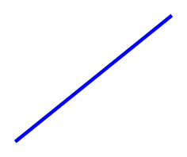

# 3dpp - 3D Pre-Processor

This is a set of scripts to help generate [PGF/TikZ](https://pgf-tikz.github.io/) code that compile to 3d scenes with perspective projection.

The idea is that the scenes will be described in Python files which allow them to be programmatic and verbose.

I've included a `Makefile` to help generate PNGs. _E.g._ if the script filename is `script-filename.py` just run:

```sh
make script-filename.png
```

You should have [XeTeX](http://xetex.sourceforge.net/) and [ImageMagick®](https://imagemagick.org/index.php) installed for the `Makefile` to work.

## How does it work?

Read all about how all this 3D stuff works in my blog series:

* [Basics of 3D](https://danzat.github.io/3d/graphics/2020/02/07/3d-perspective-projection.html)
* [Sorting segments in 3D space](https://danzat.github.io/3d/graphics/z-sort/painters/algorithm/2020/03/14/3d-dealing-with-overlaps.html)
* To be continued!

## Geometry

### Vector3

The `Vector3` class is a convenience class for doing 3d vector math:

```python
>>> from geometry import Vector3
>>> v = Vector3(1, 1, 1)
>>> v
(1, 1, 1)
>>> u = Vector3(1, -1, 2)
>>> u + v # vector addition
(2, 0, 3)
>>> 3 * v # scalar product
(3, 3, 3)
>>> v & v # dot product
2
>>> u ^ v # cross product
(3, -1, 2)
>>> u & (u ^ v)
0
```

It's also possible to instantiate vectors in spherical coordinates:

```python
>>> from geometry import spherical, deg2rad
>>> spherical(3, deg2rad(30), deg2rad(60))
(1.2990381056766584, 0.7500000000000001, 2.598076211353316)
```

There are some useful predefined vectors for convenience:

* `geometry.O` is the origin
* `geometry.hat_x`, `geometry.hat_y` and `geometry.hat_z` are unit vectors in the x, y and z directions.

### Plane

A plane is defined by a normal, an origin and a y hint (all `Vector3` instances):

```python
from geometry import Plane, hat_x, hat_z

plane = Plane(
        hat_x,              # normal
        Vector3(1, 1, 1),   # origin
        hat_z               # y hint
)
```

It's also possible to instantiate a plane from an origin and two vectors which will be used as its span.

```python
from geometry import Plane

plane = Plane.from_span(
        Vector3(1, 1, 1),   # origin
        hat_x, hat_z        # span. The first vector is also the y hint
)
```

As with `Vector3` there are predefines for the "fundamental" planes: `geometry.XY`, `geometry.YZ`, `geometry.XZ`.

## Observer

An observer represents a camera/eye and screen. It has several parameters:

* Camera/eye position (vector)
* Direction (vector)
* Screen distance
* Up hint (vector)

There's a convenience observer that acts like a camera mounted on the shell of a sphere called `SphericalCamera`:

```Python
from observers import SphericalCamera

observer = SphericalCamera(
        5,              # radius
        deg2rad(45),    # azimuth
        deg2rad(10),    # elevation
        2               # screen distance
)
```

The observer's screen is accessible as a `Plane` object via the `screen` property:

```python
observer.screen
```

## Scene3D

A scene is a collection of 3d entities: lines, points and labels.

You create a scene by just instantiating it:

```python
from scene import Scene3D

scene = Scene3D()
scene.line(tail, head, style='very thick, green')
scene.line(a, b, style='->') # arrow
scene.point(p, style='circle, fill, inner sep=0pt, minimum size=2pt')
scene.label(p, r'$\hat x$', style='red, anchor=west')
```

To render a scene you must specify the observer on which to render:

```python
scene.render(observer, scale=3)
```

Upon calling `render`, LaTeX code will be emitted to standard output.

### Drawing in 3D space

Each entity's construct accepts a `style` parameter which is just what would go in the square brackets of TikZ elements.

#### Line

Lines are specified by their endpoints, which should be `Vector3` instances.

```python
scene.line(Vector3(-1, -1, -1), Vector3(-1, -1, 1))
scene.render_latex(SphericalCamera(15, deg2rad(10), deg2rad(30), 4))
```



To draw an arrow, just add `"->"` to the `style` parameter:
```python
scene.line(Vector3(-0.5, 0, 0), Vector3(2, 0, 0), style='red, ->')
scene.line(Vector3(0, -0.5, 0), Vector3(0, 2, 0), style='green, thick, ->')
scene.line(Vector3(0, 0, -0.5), Vector3(0, 0, 1), style='blue, dashed, ->')
scene.render_latex(SphericalCamera(15, deg2rad(10), deg2rad(30), 4))
```


#### Point

#### Label

### Drawing on a plane

It's possible to draw on a plane in the plane's 2d coordinates by using the `Scene2D` contextmanager.

The `Scene2D` class exposes the same drawing primitives as `Scene3D`, but all the coordinates are in 2D (using tuples instead of `Vector3`) where `(0, 0)` is the plane's origin. The primitives will be added to the supplied `Scene3D` object:

```python
from scene import Scene2D

with Scene2D(scene, observer.screen) as sub_scene:
    sub_scene.line((-1, 0), (3, 0), style='->, very thick')
    sub_scene.label((3, 0), r'$\mathbf{x}$', style='anchor=east')

scene.render(other_observer)
```
